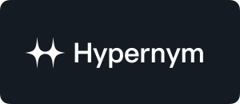

  

<h1 align="center">Effekt</h1>

  Universal animation and interaction platform for the modern web.

  <a href="https://github.com/effekt-labs/effekt">Repository</a>
  ✦
  <a href="https://www.npmjs.com/package/effekt">Package</a>
  ✦
  <a href="https://github.com/effekt-labs/effekt/releases">Releases</a>
  ✦
  <a href="https://github.com/effekt-labs/effekt/discussions">Discussions</a>

<pre align="center">pnpm add effekt</pre>

 

> [!NOTE]
>
> **Effekt** is under active development. While the **API** is solid and mostly complete, some changes may still occur before the first stable release.
>
> Ideas, [suggestions](https://github.com/effekt-labs/effekt/discussions) and code [contributions](.github/CONTRIBUTING.md) are welcome.
>
> If you find any issues or bugs, please [report](https://github.com/effekt-labs/effekt/issues/new/choose) them so the project can be improved.

 

## Core Concepts

- **Free & Open-source:** Publicly available codebase released under the MIT license.
- **Small Bundlesize:** Ultra-lightweight and optimized package without extra dependencies.
- **Tree-Shakeable**: Fully modular and modern system allows you to import only what is needed.
- **Universal:** Flexible library that works in any front-end environment.
- **API-Friendly**: Easy-to-use API designed to simplify and improve the developer experience.
- **Written in TypeScript:** Offers first-class TypeScript support that comes with bundled declarations.

## Library Features

### Core

- Multiple targets
- Individual transforms
- Complex value interpolation
- Animation Promise (async/await)
- One main object for all options
- Custom easing and offset for each property
- Advanced Methods and Events
- Multiple animation keyframes via array syntax
- Individual keyframe options via object syntax
- Stagger animation effect
- Automatic unit addition
- Unit conversion
- Color conversion
- Global configuration

### Easing

- Modular easing presets and modifiers
- Customizable spring animations

### Interaction

- InView animations
- Scroll animations
- Watch animations

### Frame

- Main frame manager
- Custom external driver

### Sequence

- Chained multiple animations

### Utils

- Utils and helpers

## Sponsors

 

  <a title="Hypernym Studio" href="https://github.com/hypernym-studio">
    <picture>
      <source media="(prefers-color-scheme: dark)" width="258" srcset="./media/hypernym-logo:dark.svg">
      <source media="(prefers-color-scheme: light)" width="258" srcset="./media/hypernym-logo:light.svg">
      
    </picture>
  </a>
  <picture>
    <source media="(prefers-color-scheme: dark)" width="258" srcset="./media/sponsor-logo:dark.svg">
    <source media="(prefers-color-scheme: light)" width="258" srcset="./media/sponsor-logo:light.svg">
    
  </picture>
  <picture>
    <source media="(prefers-color-scheme: dark)" width="258" srcset="./media/sponsor-logo:dark.svg">
    <source media="(prefers-color-scheme: light)" width="258" srcset="./media/sponsor-logo:light.svg">
    
  </picture>

## Community

Feel free to ask questions or share new ideas.

Use the official [discussions](https://github.com/effekt-labs/effekt/discussions) to get involved.

## Contribute

Check out the quick [guide](.github/CONTRIBUTING.md) for more info.

## License

Developed in 🇭🇷 Croatia, © Ivo Dolenc.

Released under the [MIT](LICENSE.txt) license.
