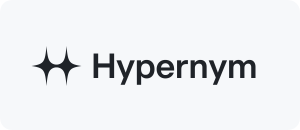
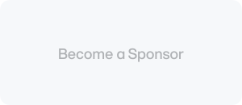

<h1 align="center">Effekt</h1>

  Universal animation and interaction platform for the modern web.

  <a href="https://github.com/effekt-labs/effekt">Repository</a>
  ✦
  <a href="https://www.npmjs.com/package/effekt">Package</a>
  ✦
  <a href="https://github.com/effekt-labs/effekt/releases">Releases</a>
  ✦
  <a href="https://github.com/effekt-labs/effekt/discussions">Discussions</a>

<pre align="center">pnpm add effekt</pre>

 

## Sponsors

 

  <a title="Hypernym Studio" href="https://github.com/hypernym-studio">
    <picture>
      <source media="(prefers-color-scheme: light)" width="240" srcset="../../media/hypernym-logo:light.svg">
      <source media="(prefers-color-scheme: dark)" width="240" srcset="../../media/hypernym-logo:dark.svg">
      
    </picture>
  </a>
  <picture>
    <source media="(prefers-color-scheme: light)" width="240" srcset="../../media/sponsor-logo:light.svg">
    <source media="(prefers-color-scheme: dark)" width="240" srcset="../../media/sponsor-logo:dark.svg">
    
  </picture>
  <picture>
    <source media="(prefers-color-scheme: light)" width="240" srcset="../../media/sponsor-logo:light.svg">
    <source media="(prefers-color-scheme: dark)" width="240" srcset="../../media/sponsor-logo:dark.svg">
    
  </picture>

## Community

Feel free to ask questions or share new ideas.

Use the official [discussions](https://github.com/effekt-labs/effekt/discussions) to get involved.

## Contribute

Check out the quick [guide](../../.github/CONTRIBUTING.md) for more info.

## License

Developed in 🇭🇷 Croatia, © Ivo Dolenc.

Released under the [MIT](LICENSE.txt) license.
